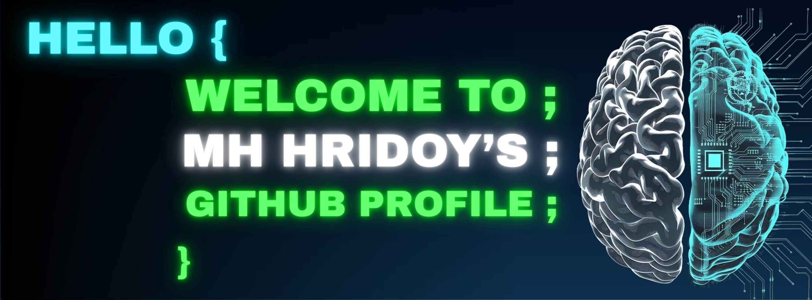

---

<h2>🛠️ My Favorite Tools</h2>

  <!-- Some badges are from https://github.com/Ileriayo/markdown-badges -->

  <h3>👨‍💻 Programming and Markup Languages</h3>

  

      
      
      
      
      
      
      
      
      
      
      
      
      
      
      
  

  <h3>🧰 Frameworks and Libraries</h3>

  

      
      
      
      
      
      
      
      
      
      
      
      
      
      
  

  <h3>🗄️ Databases and Cloud Hosting</h3>

  

      
      
      
      
      
      
      
      
      
  

  <h3>💻 Software and Tools</h3>

  

      
      
      
      
      
      
      
      
      
      
      
      
  

 
  <!-- 

    
  

   -->

<!-- Languages / Skills -->
<!-- 

 -->

<!-- Tools -->
<!-- 

 -->

<!-- Animated Divider -->

---

##  GitHub Stats

<h2 align="center">📊 GitHub Stats</h2>

  
  
  

 

<h2 align="center">💻 Top Languages</h2>

  

 

<h2 align="center">📈 Contribution Graph</h2>

  

<h2># 💻 My favorite tools and technologies</h2>

<table align="center">
  <tr>
    <td align="center" width="96">
        
       Shopify
    </td>
    <td align="center" width="96">
        
       React
    </td>
    <td align="center" width="96">
      
       Python
    </td>
    <td align="center" width="96">
        
       JavaScript
    </td>
    <td align="center" width="96">
        
       C++
    </td>
    <td align="center" width="96">
        
       MySQL
    </td>
    <td align="center" width="96">
        
       TypeScript
    </td>
    <td align="center" width="96">
        
       AWS
    </td>
    <td align="center" width="96">
        
       C#
    </td>
  </tr>
  <tr>
    <td align="center" width="96">
        
       Github
    </td>
    <td align="center" width="96"> 
        
       Git
    </td>
    <td align="center"  width="96">
        
       Laravel
    </td>
    <td align="center"  width="96">
        
       HTML5
    </td>
    <td align="center" width="96">
        
       CSS
    </td>
    <td align="center"  width="96">
        
       Bootstrap
    </td>
    <td align="center" width="96">
        
       Tailwind
    </td>
    <td align="center" width="96">
        
       jQuery
    </td>
  </tr>
 <tr>
      <td align="center" width="96">
        
       MongoDB
    </td>
        <td align="center" width="96">
        
       Nodejs
      </td>
      </td>
    <td align="center" width="96">
        
       PHP
    </td>
            <td align="center" width="96">
        
       VsCode
    </td>
    <td align="center" width="96">
      
       Sass
    </td>
              <td align="center" width="96">
        
       GraphQL
    </td>
    <td align="center" width="96">
        
       PostgreSQL
    </td>
 </tr>
</table>
  

   
---

<!-- 

 -->

---

## 🚀 Featured Projects  

### 🤖 AI Virtual GF  
A romantic conversational AI chatbot with memory, personality, and Bangla voice.  
**Tech:** HTML, CSS, JavaScript, PHP, MySQL  

### 🛠 Modern Web Tools  
Collection of interactive web apps and UI experiments.  

### ⚡ AI Utilities  
Small AI-based productivity and automation tools.  

---

⭐️ From [uigraslasu-png](https://github.com/uigraslasu-png)
